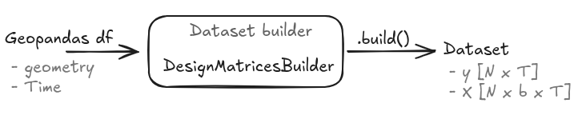

Data preparation
==================

geossm's models consume data as **design matrices organized on a site x
time grid**: an array of shape ``[N, P, T]`` for the covariates and
``[N, T]`` for the response, where ``N`` is the number of spatial sites,
``P`` the number of covariates, and ``T`` the number of timesteps.
:mod:`geossm.data_preparation` builds this grid from a
:class:`geopandas.GeoDataFrame` in *long format* (one row per
site/timestamp observation) and a Patsy/R-style model formula.

The workflow
-------------

#. Start from a :class:`geopandas.GeoDataFrame` with a ``geometry``
   column (one geometry per site) and a time column (named ``"Time"``,
   or the first ``datetime64`` column found).
#. Create a :class:`~geossm.data_preparation.DesignMatricesBuilder` with
   the GeoDataFrame and a formula, e.g. ``"AQ_pm10 ~ 1 + WE_temp_2m"``.
   The constructor validates the input (CRS/geometry, time column,
   regular time spacing, formula columns) and optionally restricts the
   data to a time window (``tmin``/``tmax``) or spatial ``domain``.
#. Call :meth:`~geossm.data_preparation.DesignMatricesBuilder.build` to
   obtain a :class:`~geossm.data_preparation.DesignMatrices` instance.

.. code-block:: python

   from geossm.data_preparation import DesignMatricesBuilder

   builder = DesignMatricesBuilder(agri, "AQ_pm10 ~ 1 + WE_temp_2m")
   dm = builder.build()
   print(dm.summary())

The formula's left-hand side names the response column (omit it, e.g.
``"~ 1 + WE_temp_2m"``, to build covariates only); the right-hand side
lists covariates, including Patsy transformations such as
``np.sqrt(...)``, ``I(...)`` or ``standardize(...)``. Missing response
values are kept as ``NaN`` (not dropped), so the site x time grid stays
rectangular -- this is what lets the state-space models below treat
irregular reporting as ordinary missing data in the Kalman filter.

Predicting at new locations/times
------------------------------------

Once a builder has been used to ``build()`` a training set, the same
builder can construct design matrices for new data with
:meth:`~geossm.data_preparation.DesignMatricesBuilder.build_predict`,
reusing the training formula's fitted state (e.g. ``standardize(...)``
statistics) so covariates are transformed consistently between training
and prediction.

Where this fits in
--------------------

:class:`~geossm.stmodel.LRStateSpaceModel` (see :doc:`low_rank_ssm`) uses
`DesignMatricesBuilder` internally -- one builder per formula, when
several response variables/domains are modeled jointly -- so most users
building an `LRStateSpaceModel` will not call it directly. It is most
useful on its own for inspecting/validating a dataset before modeling,
or when only the covariate-construction logic (formula parsing, time
grid) is needed, e.g. for an OLS baseline (see
`examples/example_DesignMatrix_OLS.py <https://github.com/jacopoRodeschini/geossm/blob/develop/examples/example_DesignMatrix_OLS.py>`_).
